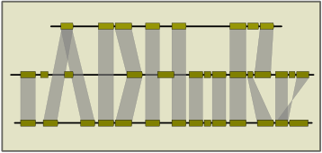

   [](https://microbadger.com/images/vibpsb/i-adhore "Get your own version badge on microbadger.com") [](https://bio.tools/i-adhore)

# i-ADHoRe 3



The i-ADHoRe algorithm is based on the initial ADHoRe algorithm. After detecting initial pairs of colinear segments using the basic ADHoRe algorithm, these pairs are aligned to each other to form a profile that combines their gene order and content information. This profile is then used to detect additional homologous segments that show conserved gene order and content when compared to the profile rather than individual segments. If such an additional segment is discovered, it is included in the profile as well and the search is repeated until no additional segments can be found. All results are outputted in tab delimited text files.

More information can be found on [bioinformatics.psb.ugent.be](http://bioinformatics.psb.ugent.be/software/details/i--ADHoRe).

## Basic Installation on Linux

This package requires CMake to build the software.  

### Installing CMake

As root, execute the following commands:

a) on Redhat / Fedora distributions

```
yum install cmake
```

b) on Ubuntu / Debian distributions

```
sudo apt-get install cmake
```

> If you encounter problems try installing the packages `build-essential` and `libpng-dev` using following command:
> ```
> sudo apt-get install build-essential libpng-dev 
> ```

### Installing i-Adhore

```
mkdir build
cd build
cmake ..
```
A useful option to specify for the cmake command is `CMAKE_INSTALL_PREFIX` so that
you can tell cmake where to install the software. For example, to install in
your local `$(HOME)/i-adhore` directory you would run:

```
cmake .. -DCMAKE_INSTALL_PREFIX=$(HOME)/i-adhore
```

Afterwards run:

```
make
```

And to install run (as root if necessary):

```
make install
```

It is required that you have a `Pthreads` library installed.  Support for `MPI`
and `Googletest` unit testing framework is optional.

## Running the test cases:

### 1) Dataset I

Starting the simulation:

```
cd testset/datasetI
./i-adhore datasetI.ini
```

(runs for about 1 minute)

Dataset I consists of the Arabidopsis thaliana genome.  The .ini file contains a "compareAligners" flag, which will compare different alignment methods.  The results are summarized at the end of the run.

### 2) Dataset II

Starting the simulation:

```
cd testset/datasetII
./i-adhore datasetII.ini
```

(runs for about 2-3 hours)

Dataset II consists of the Arabidopsis thaliana, Vitis vinifera and Populus trichocarpa genomes.  As in dataset I, the goal is to compare the different alignment methods.


## Run with docker

```
docker run vibpsb/i-adhore i-adhore <parameters>
```

> Note that the input files need to be mounted inside the container.

## Citations

- Proost, S., Fostier, J., De Witte, D., Dhoedt, B., Demeester, P., Van de Peer, Y., & Vandepoele, K. (2012). i-ADHoRe 3.0—fast and sensitive detection of genomic homology in extremely large data sets. Nucleic acids research, 40(2), e11-e11.

- Fostier, J., Proost, S., Dhoedt, B., Saeys, Y., Demeester, P., Van de Peer, Y., & Vandepoele, K. (2011). A greedy, graph-based algorithm for the alignment of multiple homologous gene lists. Bioinformatics, 27(6), 749-756.

- Simillion, C., Janssens, K., Sterck, L., Van de Peer, Y. (2008) i-ADHoRe 2.0: An improved tool to detect degenerated genomic homology using genomic profiles. [Bioinformatics 24(1):127-8](http://dx.doi.org/doi:10.1093/bioinformatics/btm449).
